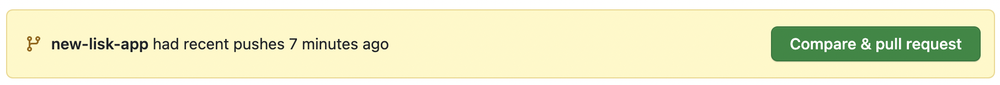
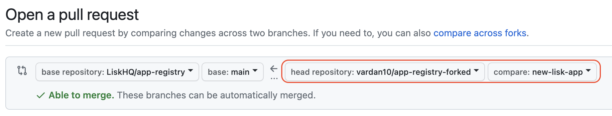

# Lisk Application Registry

Welcome to the Lisk Application Registry. The repository contains off-chain metadata for applications developed based on the Lisk SDK and any other applications that are compatible with the Lisk Protocol.
Each application will include the [*app.json*](#app-json) containing the blockchain application-specific metadata and [*nativetokens.json*](#native-tokens-json) containing metadata about the application's native tokens.

## Repository Structure

The blockchain application metadata is arranged in the following structure:   `{network}/{application}`, such as *mainnet/Lisk*.

The repository currently supports adding off-chain application metadata for the following networks:
- mainnet
- testnet
- betanet &nbsp; (temporary)
- alphanet (temporary)
- devnet &nbsp;&nbsp; (temporary)

### App JSON

*app.json* contains high-level metadata about a specific blockchain application, such as the `chainName` corresponding to an existing `chainID`. It also supplies information regarding the application's genesis block (`genesisURL`), seed nodes (`appNodes`), corresponding Lisk Service deployments (`serviceURLs`), explorers and more. This information makes it easy to bootstrap a new node in the network or interact with an existing node.

All the *app.json* files within the repository must adhere to the schema specified [here](./schema/app.json).

Example: *mainnet/Lisk/app.json*

### Native Tokens JSON

*nativetokens.json* contains metadata about the blockchain application's native tokens, which enables token discoverability across the Lisk ecosystem and for community tools.

All the *nativetokens.json* files within the repository must adhere to the schema specified [here](./schema/nativetokens.json).

Example: *mainnet/Lisk/nativetokens.json*

### Logo Images

We recommend that all the *svg* and *png* format logo images added to the repository adhere to the following resolution: `64px x 64px`.

We also recommend that all the images are stored directly under the application's directory in the `images` subdirectory.

Example: *mainnet/Lisk/images/application/lisk.svg*

## Contributing

You can create a pull request to propose changes you've made to a fork of app-registry.

To contribute to the application registry with the metadata for your blockchain application, please submit a *Pull Request* with the necessary changes. Before submitting a PR, please read the [Repository Structure](#repository-structure) section.

This app registry was inspired by [Cosmos Chain Registry](https://github.com/cosmos/chain-registry).

#### Creating a pull request from a fork

1. Navigate to the repository where you created your fork.

2. Above the list of files, in the yellow banner, click **Compare & pull request** to create a pull request for the associated branch.

   

3. On the page to create a new pull request, click **compare across forks**.

   

4. In the "base branch" dropdown menu, select the main branch of the app-registry.

   

5. In the "head fork" dropdown menu, select your fork, then use the "compare branch" drop-down menu to select the branch you made your changes in.

   

6. Type a title and description for your pull request.

7. On user-owned forks, if you want to allow anyone with push access to the upstream repository to make changes to your pull request, select **Allow edits from maintainers**.

8. To create a pull request that is ready for review, click **Create Pull Request**. To create a draft pull request, use the drop-down and select **Create Draft Pull Request**, then click **Draft Pull Request**.

> **Note:** Please make sure to validate your PR to ensure that all GitHub Actions checks are passing. This will help ensure that your changes meet the project's quality standards and do not introduce any errors or issues.

## Contributors

https://github.com/LiskHQ/app-registry/graphs/contributors

## License

Copyright 2016-2023 Lisk Foundation

Licensed under the Apache License, Version 2.0 (the "License"); you may not use this file except in compliance with the License. You may obtain a copy of the License at http://www.apache.org/licenses/LICENSE-2.0

Unless required by applicable law or agreed to in writing, software distributed under the License is distributed on an "AS IS" BASIS, WITHOUT WARRANTIES OR CONDITIONS OF ANY KIND, either express or implied. See the License for the specific language governing permissions and limitations under the License.
