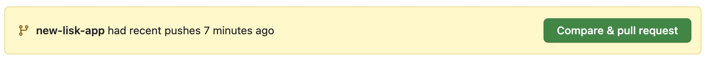
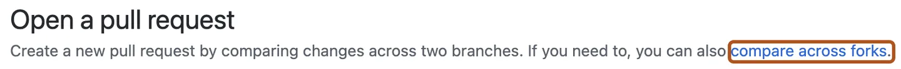
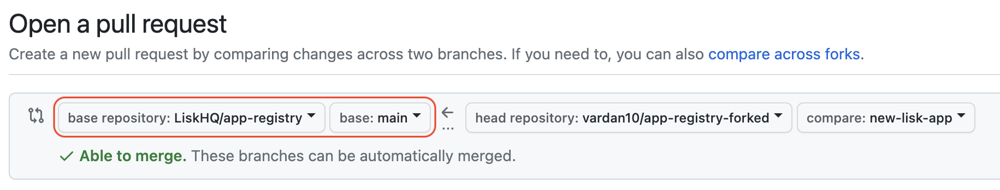
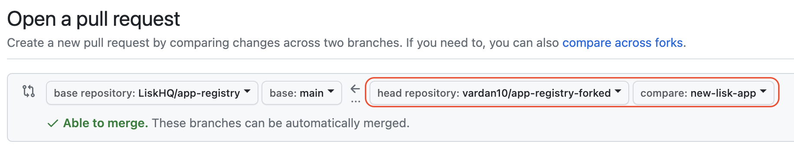

## Creating a pull request from a fork

1. Navigate to the repository where you created your fork.

2. Above the list of files, in the yellow banner, click **Compare & pull request** to create a pull request for the associated branch.

   

3. On the page to create a new pull request, click **compare across forks**.

   

4. In the "base branch" dropdown menu, select the main branch of the app-registry.

   

5. In the "head fork" dropdown menu, select your fork, then use the "compare branch" drop-down menu to select the branch you made your changes in.

   

6. Type a title and description for your pull request.

7. On user-owned forks, if you want to allow anyone with push access to the upstream repository to make changes to your pull request, select **Allow edits from maintainers**.

8. To create a pull request that is ready for review, click **Create Pull Request**. To create a draft pull request, use the drop-down and select **Create Draft Pull Request**, then click **Draft Pull Request**.

> **Note:** Please make sure to validate your PR to ensure that all GitHub Actions checks are passing. This will help ensure that your changes meet the project's quality standards and do not introduce any errors or issues.